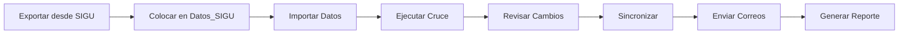

# 🎓 Automatizador de Matrícula, Admisión y Comunicaciones

Sistema automatizado de gestión de matrícula que sincroniza datos entre SIGU y archivos administrativos de Excel, con envío automatizado de correos de recordatorio mediante Outlook.


## 📋 Características Principales

- ✅ **Importación automática** del archivo Excel más reciente exportado desde SIGU
- ✅ **Cruce inteligente de datos** entre SIGU y archivo manual administrativo
- ✅ **Detección automática** de: estudiantes nuevos, cambios de estado, cambios de sede/carrera, inconsistencias
- ✅ **Sincronización bidireccional** con actualización del archivo manual
- ✅ **Envío masivo de correos** personalizados vía Outlook (recordatorios de documentos pendientes)
- ✅ **Control de reenvío** (7 días mínimo entre recordatorios)
- ✅ **Generación de reportes** ejecutivos en Excel con estadísticas y gráficos
- ✅ **Historial completo** de operaciones con auditoría
- ✅ **Panel de control** con botones para operación simplificada

## 🚀 Instalación Rápida

### Requisitos Previos

- Microsoft Excel 2016 o superior (con soporte para macros)
- Microsoft Outlook instalado y configurado
- Windows 10/11

### Opción 1: Instalación Automática

1. Descargue el proyecto completo
2. Ejecute el script `SETUP.ps1`:
   ```powershell
   powershell -ExecutionPolicy Bypass -File SETUP.ps1
   ```
3. Abra `Automatizador_Matricula.xlsm` y habilite macros

### Opción 2: Instalación Manual

Siga las instrucciones detalladas en [INSTRUCCIONES.md](INSTRUCCIONES.md)

## 📁 Estructura del Proyecto

```
cda/
├── VBA_Modules/              # Módulos VBA (código fuente)
│   ├── ModConfiguracion.bas  # Configuración central
│   ├── ModUtilidades.bas     # Funciones utilitarias
│   ├── ModSincronizacion.bas # Motor de cruce y sincronización
│   ├── ModCorreos.bas        # Automatización de correos
│   ├── ModReportes.bas       # Generación de reportes
│   ├── ModPanelControl.bas   # Panel de control
│   └── ThisWorkbook.cls      # Eventos del libro
├── PowerQuery/               # Scripts Power Query (M)
│   ├── PQ_ImportarSIGU.pq
│   ├── PQ_CruceDatos.pq
│   └── PQ_DocumentosPendientes.pq
├── Plantillas_Correo/        # Plantillas HTML para correos
├── Datos_SIGU/               # Archivos exportados de SIGU
├── Datos_Manual/             # Archivo manual administrativo
├── Reportes/                 # Reportes generados
├── Historial/                # Archivos históricos
├── SETUP.ps1                 # Script de configuración automática
├── INSTRUCCIONES.md          # Documentación completa
└── Automatizador_Matricula.xlsm  # Archivo principal
```

## 🎯 Flujo Operativo



### Proceso Completo (1 clic)

Use el botón **"EJECUTAR PROCESO COMPLETO"** para automatizar todo el flujo:
1. Importar datos SIGU y Manual
2. Ejecutar cruce de datos
3. Sincronizar archivos
4. Enviar correos de recordatorio
5. Generar reporte de cambios

## 📊 Hojas del Sistema

| Hoja | Descripción |
|------|-------------|
| **Panel** | Panel de control con botones y resumen |
| **Datos_SIGU** | Datos importados del archivo SIGU |
| **Datos_Manual** | Datos del archivo manual administrativo |
| **Cruce_Datos** | Resultado del cruce con cambios detectados |
| **Pendientes** | Estudiantes con documentos pendientes |
| **Historial** | Registro de todas las operaciones |
| **Configuracion** | Parámetros y rutas del sistema |
| **Log_Correos** | Registro de correos enviados |

## 🎨 Código de Colores

El cruce de datos usa colores para identificar tipos de cambio:

- 🟢 **Verde claro**: Estudiante nuevo
- 🟡 **Amarillo**: Cambio de estado
- 🔵 **Azul claro**: Cambio de sede o carrera
- 🔴 **Rojo claro**: Registro inconsistente
- 🟠 **Naranja**: Documentos pendientes
- 🟣 **Lavanda**: Dato actualizado (correo, teléfono)

## ⚙️ Configuración

Configure las rutas y parámetros en la hoja **Configuracion**:

- Ruta carpeta SIGU
- Ruta carpeta Manual
- Ruta de reportes
- Clave primaria (CEDULA o CARNET)
- Correo remitente
- Días mínimos entre reenvíos
- Lista de documentos requeridos

## 📧 Correos Automáticos

El sistema envía correos HTML profesionales con:

- Personalización del nombre del estudiante
- Lista detallada de documentos pendientes
- Información de sede y carrera
- Control de reenvío (configurable)
- Log completo de envíos

### Tipos de Correos

1. **Recordatorio**: Documentos pendientes
2. **Bienvenida**: Estudiantes nuevos
3. **Prueba**: Para verificar configuración

## 📈 Reportes Generados

Los reportes incluyen:

- **Resumen ejecutivo** con estadísticas
- **Detalle de cambios** por tipo
- **Documentos pendientes** por estudiante
- **Estadísticas** por sede, carrera y estado
- **Log de correos** enviados
- **Historial** de operaciones

## 🔧 Macros Disponibles

### Importación
- `Btn_ImportarSIGU` — Importa datos SIGU
- `Btn_ImportarManual` — Importa datos manual

### Procesamiento
- `Btn_CruceDatos` — Ejecuta cruce de datos
- `Btn_Sincronizar` — Sincroniza archivos

### Correos
- `Btn_EnviarCorreos` — Envía recordatorios
- `Btn_CorreosBienvenida` — Envía bienvenidas
- `Btn_CorreoPrueba` — Correo de prueba

### Reportes
- `Btn_GenerarReporte` — Reporte de cambios
- `Btn_ReporteCorreos` — Reporte de correos
- `Btn_ReporteHistorial` — Reporte del historial

## 🛠️ Tecnologías

- **VBA (Visual Basic for Applications)**: Motor principal
- **Power Query (M)**: Importación y transformación de datos
- **Microsoft Outlook**: Envío de correos
- **Excel**: Plataforma e interfaz
- **HTML/CSS**: Plantillas de correo

## 📝 Formato del Archivo SIGU

El archivo exportado de SIGU debe tener estas columnas:

| Columna | Campo |
|---------|-------|
| A | Cédula |
| B | Carnet |
| C | Nombre |
| D | Primer Apellido |
| E | Segundo Apellido |
| F | Correo Electrónico |
| G | Teléfono |
| H | Carrera |
| I | Sede |
| J | Estado |
| K | Período |
| L | Fecha Matrícula |
| M | Documentos Entregados |
| N | Observaciones |

## 🔍 Solución de Problemas

| Problema | Solución |
|----------|----------|
| Macros no se ejecutan | Habilite macros: Archivo → Opciones → Centro de confianza |
| Error al enviar correos | Verifique que Outlook esté abierto y configurado |
| No encuentra archivos | Verifique las rutas en la hoja Configuración |
| Error de referencia VBA | Herramientas → Referencias → Marcar Outlook y Scripting Runtime |

## 📚 Documentación

- [INSTRUCCIONES.md](INSTRUCCIONES.md) — Guía completa de instalación y uso
- Comentarios en código VBA
- Hoja Configuración con descripciones

## 🤝 Contribuciones

Las contribuciones son bienvenidas. Por favor:

1. Fork el proyecto
2. Cree una rama para su feature (`git checkout -b feature/AmazingFeature`)
3. Commit sus cambios (`git commit -m 'Add some AmazingFeature'`)
4. Push a la rama (`git push origin feature/AmazingFeature`)
5. Abra un Pull Request

## 📄 Licencia

Este proyecto está bajo la Licencia MIT. Ver el archivo `LICENSE` para más detalles.

## 👨‍💻 Autor

**Aaron Chinchilla**
- GitHub: [@AaronC17](https://github.com/AaronC17)

## 🙏 Agradecimientos

Desarrollado para modernizar y automatizar el proceso de matrícula, admisión y comunicación institucional.

---

<div align="center">

**⭐ Si este proyecto te fue útil, considera darle una estrella ⭐**

*Automatizador de Matrícula v1.0 - Febrero 2026*

</div>
